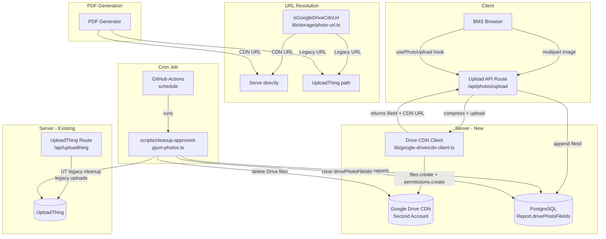
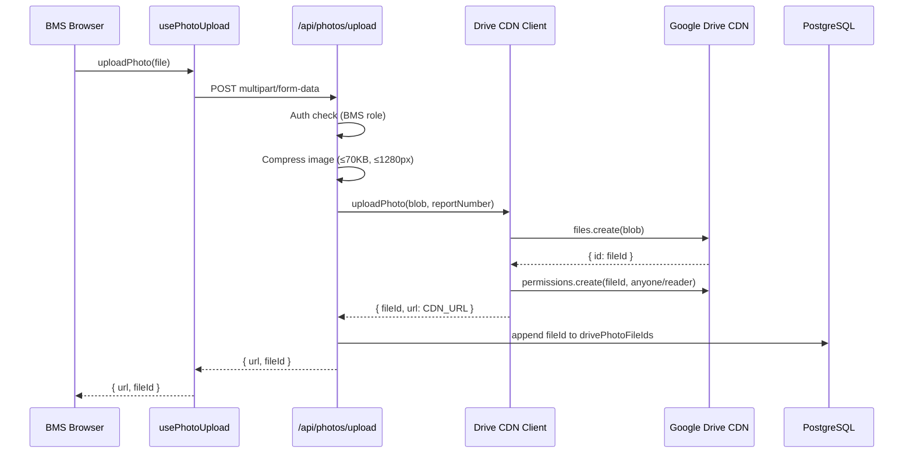
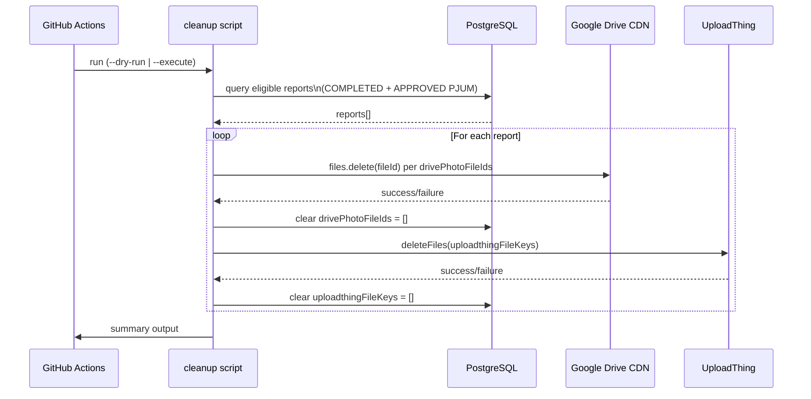

# Design Document: Google Drive Photo Storage

## Overview

Fitur ini menggantikan UploadThing sebagai backend penyimpanan foto utama dengan Google Drive pada akun Google kedua yang didedikasikan sebagai CDN foto laporan. Foto baru dilayani via URL `https://lh3.googleusercontent.com/d/{fileID}`. UploadThing dipertahankan sebagai fallback untuk laporan lama yang sudah memiliki foto tersimpan di sana.

Setelah laporan mencapai status final (status `COMPLETED` DAN termasuk dalam PJUM export dengan status `APPROVED`), semua foto Google Drive untuk laporan tersebut dihapus langsung oleh cron job GitHub Actions. Script lama (`scripts/archive-approved-pjum-photos.ts`) tetap digunakan sebagai referensi logika pencarian laporan yang eligible dan untuk cleanup foto UploadThing legacy.

### Tujuan Utama

1. **Isolasi akun**: CDN foto menggunakan akun Google terpisah dari akun yang dipakai untuk PDF dan arsip.
2. **URL stabil**: Foto baru dilayani via `https://lh3.googleusercontent.com/d/{fileID}` — URL publik yang tidak memerlukan signed token.
3. **Backward compatibility**: Foto lama (UploadThing) tetap berfungsi tanpa perubahan.
4. **Cleanup otomatis**: Cron job menghapus foto Drive secara langsung setelah laporan final disetujui.

---

## Architecture

### Diagram Komponen



### Alur Upload Foto Baru



### Alur Cron Job Cleanup



---

## Components and Interfaces

### 1. `lib/google-drive/cdn-client.ts` — Drive CDN Client (New)

Client Google Drive yang terisolasi untuk akun CDN kedua. Terpisah sepenuhnya dari `lib/google-drive/client.ts` yang dipakai untuk PDF/arsip.

```typescript
// Singleton client untuk akun CDN
export function getDriveCdnClient(): {
    drive: drive_v3.Drive;
    config: DriveCdnConfig;
}

export type DriveCdnConfig = {
    rootFolderId: string;
};
```

Environment variables yang digunakan:
- `DRIVE_CDN_CLIENT_ID`
- `DRIVE_CDN_CLIENT_SECRET`
- `DRIVE_CDN_REFRESH_TOKEN`
- `DRIVE_CDN_ROOT_FOLDER_ID`

### 2. `lib/storage/photo-url.ts` — URL Discriminator (New)

Pure function untuk membedakan CDN URL dari legacy URL.

```typescript
export const GOOGLE_DRIVE_CDN_PREFIX = "https://lh3.googleusercontent.com/d/";

/**
 * Returns true if and only if the URL is a Google Drive CDN URL.
 * Pure function — no side effects.
 */
export function isGoogleDriveCdnUrl(url: string): boolean;

/**
 * Builds a CDN URL from a Drive file ID.
 */
export function buildCdnUrl(fileId: string): string;
```

### 3. `lib/storage/drive-photo-service.ts` — Drive Photo Service (New)

Service layer untuk upload dan delete foto ke/dari Drive CDN.

```typescript
export type DrivePhotoUploadResult = {
    fileId: string;
    url: string; // CDN URL
};

export type DrivePhotoUploadFailure = {
    success: false;
    error: string;
};

export type DrivePhotoUploadOutcome =
    | ({ success: true } & DrivePhotoUploadResult)
    | DrivePhotoUploadFailure;

/**
 * Uploads a pre-compressed image Blob/File to Google Drive CDN.
 * Sets public sharing permission automatically.
 * Retries up to MAX_UPLOAD_RETRIES times on failure.
 * Does NOT re-compress — caller is responsible for compression.
 */
export async function uploadPhotoToDriveCdn(
    blob: Blob | File,
    fileName: string,
): Promise<DrivePhotoUploadOutcome>;

/**
 * Deletes a single file from Google Drive CDN by file ID.
 * Returns true on success, false on failure (non-throwing).
 */
export async function deletePhotoFromDriveCdn(
    fileId: string,
): Promise<boolean>;
```

### 4. `app/api/photos/upload/route.ts` — Upload API Route (New)

Next.js API route yang menerima multipart upload, mengkompresi, dan meneruskan ke Drive CDN.

```typescript
// POST /api/photos/upload
// Auth: BMS role required
// Body: multipart/form-data { file: File, reportNumber: string }
// Response: { url: string; fileId: string }
// Errors: 400 (invalid file), 401 (unauthenticated), 403 (wrong role), 500 (upload failed)
```

### 5. `lib/hooks/use-photo-upload.ts` — Client Hook (New)

React hook yang menggantikan `compressAndUploadToUT` di semua alur upload foto.

```typescript
export type PhotoUploadResult = {
    url: string;
    fileId: string;
};

export function usePhotoUpload(): {
    uploadPhoto: (file: File) => Promise<PhotoUploadResult | null>;
    isUploading: boolean;
};
```

### 6. `scripts/cleanup-approved-pjum-photos.ts` — Cron Script (New)

Script Node.js yang menggantikan `scripts/archive-approved-pjum-photos.ts` untuk cleanup foto setelah PJUM disetujui. Menghapus foto Drive secara langsung (tidak ada move/archive) dan membersihkan foto UploadThing legacy menggunakan logika dari script lama.

```typescript
// CLI: npx tsx scripts/cleanup-approved-pjum-photos.ts [--dry-run | --execute]
// Output: summary ke stdout + output.txt
```

### 7. `app/api/cron/cleanup-approved-photos/route.ts` — Cron HTTP Trigger (New)

Next.js API route yang dipanggil oleh GitHub Actions untuk menjalankan cleanup script.

---

## Data Models

### Perubahan Schema Prisma

Tambahkan field `drivePhotoFileIds` pada model `Report`:

```prisma
model Report {
  // ... existing fields ...

  // UploadThing file keys — retained for legacy cleanup
  uploadthingFileKeys       Json      @default("[]")

  // Google Drive CDN file IDs — for new photos uploaded after this feature
  drivePhotoFileIds         Json      @default("[]")

  // ... rest of existing fields ...
}
```

### Migration

```sql
ALTER TABLE "Report"
ADD COLUMN "drivePhotoFileIds" JSONB NOT NULL DEFAULT '[]';
```

### Tipe Data

```typescript
// Stored in Report.drivePhotoFileIds
type DrivePhotoFileIds = string[]; // Array of Google Drive file IDs

// CDN URL format
// https://lh3.googleusercontent.com/d/{fileId}
// Example: https://lh3.googleusercontent.com/d/1BxiMVs0XRA5nFMdKvBdBZjgmUUqptlbs74OgVE2upms
```

### Invariant Data

| Field | Tipe | Default | Keterangan |
|-------|------|---------|------------|
| `drivePhotoFileIds` | `Json` | `[]` | File ID Drive untuk foto baru |
| `uploadthingFileKeys` | `Json` | `[]` | Key UT untuk foto lama (tidak diubah) |

---

## Correctness Properties

*A property is a characteristic or behavior that should hold true across all valid executions of a system — essentially, a formal statement about what the system should do. Properties serve as the bridge between human-readable specifications and machine-verifiable correctness guarantees.*

### Property 1: CDN URL Discriminator — Round Trip

*For any* string that starts with `https://lh3.googleusercontent.com/d/`, `isGoogleDriveCdnUrl(url)` SHALL return `true`; and for any string that does not start with that prefix, it SHALL return `false`.

**Validates: Requirements 4.3, 4.4**

---

### Property 2: Upload Result Shape

*For any* successful upload to Google Drive CDN (mocked Drive API), the returned result SHALL contain both a `url` field matching the CDN URL pattern (`https://lh3.googleusercontent.com/d/{fileId}`) and a non-empty `fileId` string.

**Validates: Requirements 2.1, 2.3**

---

### Property 3: Drive File ID Persistence — Append

*For any* report with an initial `drivePhotoFileIds` array of length N, after a successful photo upload the `drivePhotoFileIds` array SHALL have length N+1 and SHALL contain the new `fileId`.

**Validates: Requirements 3.1**

---

### Property 4: Drive File ID Persistence — Remove

*For any* report with a `drivePhotoFileIds` array containing a given `fileId`, after that file is deleted from Drive CDN the `drivePhotoFileIds` array SHALL no longer contain that `fileId`.

**Validates: Requirements 3.3**

---

### Property 5: Cron Job Eligibility Filter

*For any* set of reports with varying statuses and PJUM export associations, the cron job's eligibility query SHALL return only reports where `Report.status = COMPLETED` AND the report's `reportNumber` appears in a `PjumExport` with `status = APPROVED` and `approvedAt IS NOT NULL`.

**Validates: Requirements 7.1**

---

### Property 6: Cron Job Dry Run Idempotence

*For any* set of eligible reports, running the cron job with `--dry-run` SHALL NOT modify any `drivePhotoFileIds`, `uploadthingFileKeys`, or any other database field, and SHALL NOT make any delete calls to Google Drive CDN or UploadThing.

**Validates: Requirements 7.6**

---

### Property 7: Cron Job Summary Completeness

*For any* cron job run (dry-run or execute), the output summary SHALL contain all required fields: total reports processed, total Drive files deleted (or planned), total Drive deletion failures, and total UploadThing keys processed.

**Validates: Requirements 7.7**

---

### Property 8: Legacy URL Backward Compatibility

*For any* URL that does not match the CDN URL pattern (i.e., `isGoogleDriveCdnUrl(url) === false`), the URL resolution path SHALL route to the UploadThing fallback without error.

**Validates: Requirements 4.2, 10.3**

---

### Property 9: Image Compression Constraints

*For any* input image file, the compression step in the Upload API SHALL produce an output where the file size is ≤ 70 KB AND the longest dimension is ≤ 1280 pixels.

**Validates: Requirements 8.4**

---

## Error Handling

### Upload Failures

| Skenario | Behavior |
|----------|----------|
| Drive API gagal (network error) | Retry hingga 3x dengan exponential backoff; kembalikan `{ success: false }` setelah semua retry habis |
| Drive API gagal set permission | Log warning; tetap kembalikan hasil upload (foto terupload tapi mungkin tidak publik) — retry permission |
| File bukan image MIME type | Return HTTP 400 dengan pesan deskriptif |
| File > 4 MB | Return HTTP 400 sebelum kompresi |
| User tidak terautentikasi | Return HTTP 401 |
| User bukan BMS | Return HTTP 403 |
| Kompresi gagal | Return HTTP 500; log error |

### Cron Job Failures

| Skenario | Behavior |
|----------|----------|
| Drive delete gagal untuk satu file ID | Log failure dengan fileId dan reportNumber; lanjutkan ke file berikutnya |
| Drive delete gagal untuk semua file ID satu report | Log failure; JANGAN clear `drivePhotoFileIds` untuk report tersebut; lanjutkan ke report berikutnya |
| UploadThing delete gagal | Log failure; lanjutkan (sama seperti script lama) |
| DB update gagal setelah delete berhasil | Log critical error; file sudah terhapus dari Drive tapi ID masih di DB — akan dicoba lagi di run berikutnya |
| Env vars CDN tidak ada | Throw error deskriptif saat startup; abort seluruh run |

### PDF Generation Failures

| Skenario | Behavior |
|----------|----------|
| Fetch CDN URL gagal (non-2xx) | Skip foto tersebut; log failure dengan URL dan reportNumber; lanjutkan generate PDF |
| Fetch UploadThing URL gagal | Sama seperti CDN — skip dan log |

### Retry Strategy

```typescript
const MAX_UPLOAD_RETRIES = 3;
const RETRY_DELAY_MS = [500, 1000, 2000]; // exponential backoff
```

---

## Testing Strategy

### Unit Tests

Fokus pada logika murni yang tidak memerlukan infrastruktur eksternal:

1. **`isGoogleDriveCdnUrl`** — test dengan berbagai URL (CDN, UploadThing, empty string, malformed URL)
2. **`buildCdnUrl`** — test bahwa fileId diembed dengan benar
3. **URL routing logic** — test bahwa CDN URL dan legacy URL dirouting dengan benar
4. **Compression constraints** — test bahwa output kompresi memenuhi batas ukuran dan dimensi
5. **Eligibility filter** — test query logic dengan berbagai kombinasi status report dan PJUM

### Property-Based Tests

Menggunakan **fast-check** (TypeScript PBT library). Setiap property test dijalankan minimum **100 iterasi**.

Tag format: `Feature: google-drive-photo-storage, Property {N}: {property_text}`

| Property | Test | Generator |
|----------|------|-----------|
| P1: CDN URL Discriminator | `fc.string()` + CDN URL variants | Arbitrary strings, CDN URLs dengan berbagai fileId |
| P2: Upload Result Shape | Mock Drive API | Arbitrary file names, arbitrary fileIds |
| P3: File ID Append | Mock DB | Arbitrary initial arrays + arbitrary fileIds |
| P4: File ID Remove | Mock DB | Arbitrary arrays containing the target fileId |
| P5: Eligibility Filter | In-memory report sets | Arbitrary combinations of status + PJUM associations |
| P6: Dry Run Idempotence | Mock Drive + DB | Arbitrary eligible report sets |
| P7: Summary Completeness | Mock Drive + DB | Arbitrary run scenarios |
| P8: Legacy URL Routing | Pure function | Arbitrary non-CDN URLs |
| P9: Compression Constraints | Real compression | Arbitrary image sizes and formats |

### Integration Tests

Test yang memerlukan infrastruktur nyata atau mock yang lebih berat:

1. **Upload API route** — test auth (401, 403), file validation (400), successful upload flow
2. **Cron job end-to-end** — test dengan DB test instance, mock Drive dan UT APIs
3. **PDF generation** — test bahwa foto CDN dan legacy keduanya di-fetch dengan benar

### Smoke Tests

Verifikasi satu kali untuk setup dan konfigurasi:

1. **Env vars validation** — verifikasi bahwa missing `DRIVE_CDN_*` vars throw error deskriptif
2. **Schema migration** — verifikasi `drivePhotoFileIds` field ada dengan default `[]`
3. **UploadThing route** — verifikasi `/api/uploadthing` masih berfungsi setelah perubahan
4. **No remaining `compressAndUploadToUT` calls** — verifikasi semua alur foto sudah migrasi ke hook baru

### Regression Tests

Untuk memastikan backward compatibility:

1. **Legacy URL resolution** — test bahwa semua URL UploadThing yang ada tetap resolve dengan benar
2. **`uploadthingFileKeys` integrity** — verifikasi tidak ada migration yang mengubah data existing
3. **PDF dengan foto legacy** — test bahwa PDF generation tetap berfungsi untuk laporan lama

---

## Research Findings

### Google Drive CDN URL Format

URL `https://lh3.googleusercontent.com/d/{fileId}` adalah URL publik Google Drive yang berfungsi sebagai CDN image. URL ini:
- Tidak memerlukan autentikasi untuk akses (jika permission "anyone with link" sudah di-set)
- Stabil selama file tidak dihapus
- Mendukung serving gambar langsung di browser dan di `@react-pdf/renderer`

Sumber: [Google Drive API — Share files](https://developers.google.com/drive/api/guides/manage-sharing)

### Permission Setting

Untuk membuat file publik via API:

```typescript
await drive.permissions.create({
    fileId,
    requestBody: {
        role: "reader",
        type: "anyone",
    },
    supportsAllDrives: true,
});
```

### Isolasi Akun

Pattern singleton yang sudah ada di `lib/google-drive/client.ts` akan direplikasi untuk CDN client dengan env vars berbeda. Kedua client hidup berdampingan tanpa konflik karena masing-masing memiliki OAuth2 instance terpisah.

### fast-check untuk PBT

Library `fast-check` adalah pilihan standar untuk property-based testing di TypeScript/JavaScript. Sudah mature dan well-maintained.

```bash
npm install --save-dev fast-check
```

Contoh penggunaan untuk Property 1:

```typescript
import fc from "fast-check";
import { isGoogleDriveCdnUrl, GOOGLE_DRIVE_CDN_PREFIX } from "@/lib/storage/photo-url";

test("P1: CDN URL discriminator round trip", () => {
    // Any CDN URL returns true
    fc.assert(
        fc.property(
            fc.string({ minLength: 1 }),
            (fileId) => {
                const url = `${GOOGLE_DRIVE_CDN_PREFIX}${fileId}`;
                return isGoogleDriveCdnUrl(url) === true;
            }
        ),
        { numRuns: 100 }
    );

    // Any non-CDN URL returns false
    fc.assert(
        fc.property(
            fc.string().filter(s => !s.startsWith(GOOGLE_DRIVE_CDN_PREFIX)),
            (url) => isGoogleDriveCdnUrl(url) === false
        ),
        { numRuns: 100 }
    );
});
```
