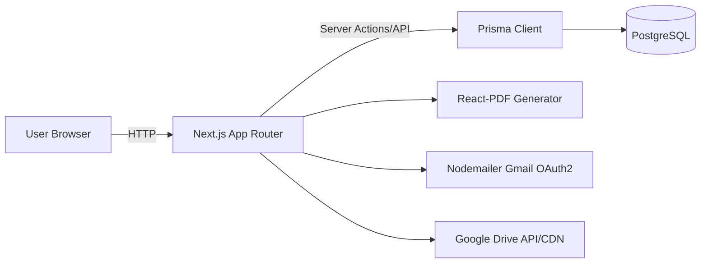

# AI_CONTEXT - SPARTA Maintenance

Dokumen ini merangkum konteks teknis dan bisnis dari project SPARTA Maintenance berdasarkan kode dan dokumentasi yang ada.

## 1. PROJECT OVERVIEW

- Nama project: SPARTA Maintenance
- Versi: 0.1.0
- Deskripsi singkat: Sistem pelaporan dan tracking aset maintenance untuk toko, mencakup checklist kondisi, estimasi biaya, proses perbaikan, dan approval berjenjang.
- Tujuan bisnis: Memusatkan proses pelaporan kerusakan dan monitoring perbaikan toko (BMS, BMC, BNM Manager, Admin) dari awal hingga selesai.
- Status project: PRODUCTION
- Tanggal dibuat: 10 Feb 2026
- Last updated: 12 Mei 2026

## 2. TECH STACK & ARCHITECTURE

### Tech Stack Utama

| Layer        | Teknologi                                               |
| ------------ | ------------------------------------------------------- |
| Framework    | Next.js 16 (App Router)                                 |
| UI           | React 19, Tailwind CSS 4, shadcn/ui                     |
| Bahasa       | TypeScript 5                                            |
| ORM          | Prisma 7                                                |
| Database     | PostgreSQL (Aiven)                                      |
| Storage Foto | Google Drive (Drive CDN)                                |
| Auth         | Session JWT (jose) + cookie httpOnly                    |
| PDF          | @react-pdf/renderer                                     |
| Email        | Nodemailer + Gmail OAuth2                               |
| Runtime      | Node.js (dev >= 18, Docker image node:22-bookworm-slim) |

Catatan:

- UploadThing dan Supabase sudah tidak digunakan.

### Arsitektur Sistem

- Monolith Next.js (App Router) dengan kombinasi Server Components, Server Actions, dan API Routes.
- Data persistence lewat Prisma ke PostgreSQL.
- File/foto diunggah ke Google Drive CDN (proksi foto melalui API untuk menghindari 403/429).
- PDF report dan PJUM dihasilkan server-side dengan React-PDF dan bisa diarsipkan ke Google Drive.

### Diagram High-Level



### External Services dan Integrasi

- Aiven PostgreSQL (DATABASE_URL, DIRECT_URL)
- Google Drive API (GOOGLE*\* dan DRIVE_CDN*\*)
- Gmail OAuth2 untuk notifikasi email
- Render (deploy Docker)
- GitHub Actions (backup DB, cleanup pending, cleanup approved photos)

## 3. STRUKTUR PROJECT

### Struktur Folder Utama

```
sparta-maintenance/
  app/                     # Next.js App Router (pages, layouts, routes)
  app/api/                 # API routes (route.ts)
  app/reports/actions/     # Server Actions untuk workflow laporan
  components/              # UI components (shadcn/ui + shared)
  lib/                     # Layanan domain: auth, prisma, pdf, email, dll
  prisma/                  # Schema, migrations, seed
  scripts/                 # Script utilitas dan maintenance
  public/                  # Static assets
  docs/                    # Dokumentasi deployment dan ops
```

### Konvensi Penamaan

- App Router: `page.tsx`, `layout.tsx`, `loading.tsx`, `error.tsx`, `route.ts`.
- Sub-komponen halaman: folder `_components/`.
- Server actions: `app/**/actions/*.ts` dengan `"use server"`.
- Query server-only: file bertanda `"server-only"`.

### Entry Point Aplikasi

- Next.js App Router: `app/layout.tsx` dan `app/page.tsx`.
- API endpoints: `app/api/**/route.ts`.

## 4. BISNIS PROSES & DOMAIN

### Domain Utama

Platform pelaporan dan pelacakan pekerjaan maintenance toko. Aktor utama: BMS (pelapor dan eksekutor), BMC (reviewer), BNM Manager (final approval), ADMIN (ops/management).

### Entitas Bisnis dan Relasi

- User
    - NIK (PK), email (unique), name, role, branchNames, passwordHash, mustChangePassword
    - Relasi: Report (created), ApprovalLog, ActivityLog, UserPresence
- Store
    - code (PK), name, branchName, isActive
    - Relasi: Report
- Report
    - reportNumber (PK), branchName, storeName, storeCode
    - status (ReportStatus), totalEstimation, totalReal
    - items (JSONB), estimations (JSONB)
    - startSelfieUrl, startReceiptUrls (JSONB), startMaterialStores (JSONB)
    - completionNotes, completionAdditionalPhotos (JSONB), completionAdditionalNote, finishedAt
    - pjumExportedAt, PDF snapshot paths, reportFinalDriveUrl
    - uploadthingFileKeys, drivePhotoFileIds (JSONB)
    - Relasi: ApprovalLog, ActivityLog, Store, User (createdBy)
- ApprovalLog
    - id, reportNumber, approverNIK, status, notes, createdAt
- ActivityLog
    - id, reportNumber, actorNIK, action, notes, createdAt
- UserPresence
    - userId, lastSeen
- PjumExport
    - id, status, bmsNIK, branchName, weekNumber, date range, reportNumbers
    - approval metadata dan PDF path
- PjumBankAccount
    - bmsNIK, bankAccountNo, bankAccountName, bankName
- AppSetting
    - key, value, updatedAt, updatedBy
- GoogleDriveFolderCache
    - cacheKey, folderId

### Aturan Bisnis Kritis

- Status report mengikuti alur: DRAFT -> PENDING_ESTIMATION -> ESTIMATION_APPROVED -> IN_PROGRESS -> PENDING_REVIEW -> APPROVED_BMC -> COMPLETED, dengan cabang revisi dan reject.
- BMS hanya bisa akses report miliknya sendiri.
- BMC/BNM Manager hanya bisa akses report sesuai branchNames.
- Preventive Category I hanya boleh diisi per kuartal; validasi server-side saat submit.
- Estimasi REKANAN zero-cost dapat bypass tahap kerja BMS (langsung ke APPROVED_BMC).
- Start work membutuhkan selfie, nota, dan toko material (kecuali skipPhotos untuk total estimasi nol).
- Completion menyimpan realisasi item dan totalReal di report.

### Glossary

- BMS: Branch Maintenance Support (pelapor dan eksekutor)
- BMC: Branch Maintenance Coordinator (review estimasi/pekerjaan)
- BNM Manager: final approval
- PJUM/PUM: dokumen rekap dan persetujuan pengeluaran (PDF)
- Estimasi: rencana biaya BMS
- Realisasi: biaya aktual saat pekerjaan selesai

## 5. ALUR SISTEM (END-TO-END)

### Alur Registrasi dan Autentikasi

- Registrasi mandiri: Tidak ditemukan / perlu dikonfirmasi.
- Pembuatan user: via script `npm run create-user`.
- Login:
    1. User input email + password.
    2. Rate limit per email+IP (5 attempts/5 menit).
    3. Validasi password (bcrypt) atau legacy branch name.
    4. Session JWT diset di cookie httpOnly.
    5. Jika mustChangePassword, redirect ke `/change-password`.
- Lupa password:
    1. User input email.
    2. Sistem mengirim email reset dengan token JWT.
    3. Link reset menghapus passwordHash dan memaksa change-password.

### Alur Bisnis Utama (Laporan)

1. BMS membuat laporan (draft) dan isi checklist + estimasi.
2. Submit laporan -> status PENDING_ESTIMATION, ActivityLog dibuat.
3. BMC review estimasi:
    - approve -> ESTIMATION_APPROVED (atau APPROVED_BMC untuk rekanan zero-cost)
    - reject revision -> ESTIMATION_REJECTED_REVISION
    - reject -> ESTIMATION_REJECTED
4. BMS start work (IN_PROGRESS) + selfie/nota/toko material (jika biaya > 0).
5. BMS submit completion (PENDING_REVIEW), isi realisasi biaya, foto setelah, catatan.
6. BMC review completion:
    - approve -> APPROVED_BMC
    - reject revision -> REVIEW_REJECTED_REVISION
7. BNM Manager final approval:
    - approve -> COMPLETED (PDF snapshot dibuat)
    - reject revision -> REVIEW_REJECTED_REVISION

### Error Handling dan Fallback

- Error database dipetakan ke pesan aman (getErrorDetail/getDbErrorMessage).
- Logging terstruktur untuk operasi penting.
- Preview PDF dan endpoint debug hanya aktif non-production.

### Notifikasi dan Background Jobs

- Email reset password dan notifikasi PJUM menggunakan Gmail OAuth2.
- GitHub Actions:
    - Backup DB harian ke Google Drive.
    - Cleanup pending reports (> 14 hari) + hapus foto.
    - Cleanup approved PJUM photos.
- Endpoint cron manual: `/api/cron/cleanup-pending-reports` dengan Bearer token.

## 6. API & INTERFACE

### Daftar Endpoint API

| Method   | Path                              | Deskripsi                                     | Auth                |
| -------- | --------------------------------- | --------------------------------------------- | ------------------- |
| GET      | /api/health                       | Health check                                  | Public              |
| HEAD     | /api/health                       | Health check                                  | Public              |
| GET      | /api/auth/session                 | Cek session expired                           | Cookie              |
| GET      | /api/presence                     | List online users                             | Cookie              |
| POST     | /api/presence                     | Mark user online                              | Cookie              |
| GET      | /api/reports/[reportNumber]/pdf   | Stream PDF report                             | Cookie + role rules |
| GET      | /api/reports/pjum-pdf             | Stream PDF PJUM                               | Cookie (BMC/BNM)    |
| GET      | /api/reports/preview-pdf          | Preview PDF report (dev only)                 | Public (non-prod)   |
| GET      | /api/preview-pdf                  | Preview PDF report dev/staging                | Public (non-prod)   |
| GET      | /api/preview-pjum                 | Preview PDF PJUM (dev only)                   | Public (non-prod)   |
| GET      | /api/drive/report-archive         | Redirect folder Drive report                  | BMC                 |
| GET      | /api/drive/pjum-archive           | Redirect folder Drive PJUM                    | BMC                 |
| POST     | /api/photos/upload                | Upload photo ke Drive CDN                     | BMS                 |
| GET      | /api/photos/[fileId]              | Proxy file Drive CDN                          | Public              |
| GET      | /api/photos/test-url              | Debug akses URL Drive (dev)                   | BMS                 |
| GET      | /api/photos/debug-env             | Debug env Drive CDN (dev)                     | BMS                 |
| GET      | /api/cron/cleanup-pending-reports | Cleanup pending reports (cron)                | Bearer token        |
| GET/POST | /api/uploadthing                  | UploadThing handler (legacy, tidak digunakan) | Cookie              |

### Request/Response Endpoint Kritis

- POST /api/photos/upload
    - Request: multipart/form-data, field `file`
    - Response success: `{ url: string, fileId: string }`
    - Error: 400/401/403/500
- GET /api/reports/[reportNumber]/pdf
    - Response: binary PDF, header `Content-Type: application/pdf`
    - Error: 401/403/404/500
- GET /api/reports/pjum-pdf
    - Query: `ids` (wajib, comma-separated), `week` (1..5), `bmsNIK`, `from`, `to`
    - Response: binary PDF
    - Error: 400/403/500
- GET /api/cron/cleanup-pending-reports
    - Header: `Authorization: Bearer <CRON_SECRET>`
    - Response: JSON summary

### Autentikasi dan Otorisasi

- Session JWT via cookie `app_session`.
- Role-based access via `requireRole`, `requireOwnership`, `requireBranchAccess`.
- CSRF validation untuk mutating server actions.

### Rate Limiting dan Error Response

- Rate limit login: 5 percobaan / 5 menit per email+IP.
- Error response API umumnya: `{ error: string }`.

## 7. DATABASE & DATA MODEL

### Tabel dan Kolom Penting

| Tabel                  | Kolom Kunci                                                   | Catatan                                           |
| ---------------------- | ------------------------------------------------------------- | ------------------------------------------------- |
| User                   | NIK (PK), email (unique), role, branchNames                   | role: BMS, BMC, BNM_MANAGER, BRANCH_ADMIN, ADMIN  |
| Store                  | code (PK), name, branchName                                   | isActive flag                                     |
| Report                 | reportNumber (PK), status, items (JSONB), estimations (JSONB) | totalEstimation, totalReal, start/complete fields |
| ApprovalLog            | id, reportNumber, approverNIK, status                         | audit approval                                    |
| ActivityLog            | id, reportNumber, actorNIK, action                            | audit aktivitas                                   |
| UserPresence           | userId, lastSeen                                              | online tracking                                   |
| PjumExport             | id, status, bmsNIK, weekNumber, reportNumbers                 | PJUM workflow                                     |
| PjumBankAccount        | id, bmsNIK, bankAccountNo                                     | data rekening PJUM                                |
| AppSetting             | key, value                                                    | maintenance toggle                                |
| GoogleDriveFolderCache | cacheKey, folderId                                            | cache folder Drive                                |

### Relasi

- User 1..N Report (createdBy)
- User 1..N ApprovalLog, ActivityLog
- Store 1..N Report
- Report 1..N ApprovalLog, ActivityLog

### Index Penting

- Report: status, createdByNIK, storeCode, kombinasi status
- Store: branchName
- ActivityLog: reportNumber, actorNIK
- PjumExport: status, branchName, createdByNIK
- PjumBankAccount: bmsNIK, addedByNIK

### Seed Data

- Ada `prisma/seed.ts` (detail seed: tidak ditemukan / perlu dikonfirmasi)

### Migration Strategy

- Gunakan `prisma migrate dev` dan `prisma migrate deploy`.
- Jangan gunakan `prisma db push` (policy internal).

## 8. KONFIGURASI & ENVIRONMENT

| Env Var                       | Kegunaan                             | Wajib               |
| ----------------------------- | ------------------------------------ | ------------------- |
| DATABASE_URL                  | Koneksi DB runtime (pooled)          | Ya                  |
| DIRECT_URL                    | Koneksi DB non-pooled (CLI/migrasi)  | Ya                  |
| SESSION_SECRET                | Secret JWT session                   | Ya                  |
| APP_BASE_URL                  | Base URL server                      | Opsional            |
| NEXT_PUBLIC_APP_URL           | Base URL publik                      | Ya                  |
| RENDER_EXTERNAL_URL           | Base URL Render                      | Opsional            |
| NEXT_PUBLIC_SUPABASE_URL      | Legacy Supabase (tidak digunakan)    | Tidak (legacy)      |
| NEXT_PUBLIC_SUPABASE_ANON_KEY | Legacy Supabase (tidak digunakan)    | Tidak (legacy)      |
| GOOGLE_CLIENT_ID              | OAuth Gmail/Drive                    | Ya                  |
| GOOGLE_CLIENT_SECRET          | OAuth Gmail/Drive                    | Ya                  |
| GOOGLE_REFRESH_TOKEN          | OAuth refresh token                  | Ya                  |
| GMAIL_USER                    | Email pengirim                       | Ya                  |
| GOOGLE_DRIVE_ROOT_FOLDER_ID   | Root folder Drive (arsip)            | Ya                  |
| DRIVE_CDN_CLIENT_ID           | OAuth Drive CDN                      | Ya (jika pakai CDN) |
| DRIVE_CDN_CLIENT_SECRET       | OAuth Drive CDN                      | Ya (jika pakai CDN) |
| DRIVE_CDN_REFRESH_TOKEN       | OAuth Drive CDN                      | Ya (jika pakai CDN) |
| DRIVE_CDN_ROOT_FOLDER_ID      | Root folder CDN                      | Ya (jika pakai CDN) |
| UPLOADTHING_TOKEN             | Legacy UploadThing (tidak digunakan) | Tidak (legacy)      |
| CRON_SECRET                   | Token cron endpoint                  | Opsional            |
| CLEANUP_PENDING_EXPIRY_DAYS   | TTL pending report                   | Opsional            |
| MAINTENANCE_MODE              | Toggle maintenance                   | Opsional            |
| MAINTENANCE_MESSAGE           | Pesan maintenance                    | Opsional            |
| REQUEST_LOG_ENABLED           | Enable request log                   | Opsional            |
| REQUEST_LOG_SAMPLE_RATE       | Sample rate log                      | Opsional            |
| REQUEST_LOG_SLOW_MS           | Threshold slow request               | Opsional            |
| DEV_EMAIL_RECIPIENT           | Fallback email dev                   | Opsional            |
| BACKUP_DRIVE_FOLDER_ID        | Folder Drive untuk backup            | Opsional            |

## 9. CARA MENJALANKAN PROJECT

### Prerequisites

- Node.js >= 18
- npm
- PostgreSQL database (Aiven recommended)
- Google Drive OAuth (untuk storage foto)

### Setup Awal

1. `npm install`
2. Buat file `.env` sesuai daftar env di atas.
3. `npm run db:generate`
4. Migration: `npx prisma migrate dev --name <name>` lalu `npx prisma migrate deploy`.

### Perintah Umum

- `npm run dev` - dev server
- `npm run build` - build production
- `npm run start` - start production
- `npm run lint` - lint
- `npm run db:studio` - Prisma Studio
- `npm run db:seed` - seed data
- `npm run create-user` - create user
- `npm run backup:db` - backup DB
- `npm run cleanup:pending` - cleanup pending reports

## 10. TESTING STRATEGY

- Test files: Tidak ditemukan / perlu dikonfirmasi.
- Framework test: Tidak ditemukan / perlu dikonfirmasi.
- Coverage: Tidak ditemukan / perlu dikonfirmasi.

## 11. DEPLOYMENT & INFRASTRUKTUR

- Deploy utama via Render (Dockerfile + render.yaml).
- Health check: GET /api/health.
- CI/CD: GitHub Actions
    - Daily backup DB ke Google Drive.
    - Cleanup pending reports harian.
    - Cleanup approved PJUM photos.
- Logging:
    - Request log JSON via proxy runtime.
    - Error hooks via instrumentation (node runtime).

## 12. POLA & KONVENSI KODE

- Server Actions: requireAuth/requireRole, validateCSRF, Zod, ActivityLog, revalidatePath.
- Query server: file bertanda `server-only`.
- JSONB untuk `Report.items` dan `Report.estimations` (bukan tabel relasional baru).
- Logging via `lib/logger` (structured JSON).
- Error handling: getDbErrorMessage + getErrorDetail.

## 13. KEAMANAN

- Session JWT disimpan di cookie httpOnly (secure di production).
- CSRF validation via origin/host check.
- Role-based access: requireRole + branch scoping.
- Validasi input: Zod pada draft, validasi server-side di actions.
- Rate limit login per email + IP.
- API upload foto membatasi mime dan size.

## 14. KNOWN ISSUES & TECHNICAL DEBT

- Route preview PJUM memiliki TODO untuk dihapus/nonaktifkan di production.
- Endpoint debug (photos/debug-env, photos/test-url) bertanda DEBUG ONLY.
- README masih menyarankan `db:push`, bertentangan dengan policy internal (gunakan migrate).
- Struktur file/folder belum rapi dan tidak konsisten; komponen belum reusable secara konsisten.
- Beberapa tabel/kolom tidak digunakan dan perlu audit.
- Struktur route URL belum konsisten dan perlu perapihan.
- UI/UX belum konsisten antar role; arah ke depan mengikuti pola UI role ADMIN.
- Tidak ada test suite terdeteksi.

## 15. PANDUAN UNTUK AI AGENT

### Boleh dilakukan

- Gunakan komponen shadcn/ui sebelum membuat komponen custom.
- Ikuti pola server action (auth, CSRF, Zod, ActivityLog, revalidate).
- Gunakan JSONB untuk report items dan estimations.
- Gunakan logging terstruktur untuk error dan operasi penting.
- Untuk UI baru, ikuti pola UI role ADMIN sebagai baseline.

### Tidak boleh dilakukan

- Jangan gunakan `prisma db push` atau operasi destruktif tanpa konfirmasi.
- Jangan menambah komponen custom jika padanan shadcn tersedia.

### File/folder sensitif

- Skema DB, workflow deploy, dan data ops: perlu konfirmasi jika perubahan besar.
- Detail lebih lanjut: Tidak ditemukan / perlu dikonfirmasi.

### Cara menambah fitur baru

1. Tentukan role dan authorization scope.
2. Tambahkan server action dengan validasi input.
3. Update ActivityLog untuk audit trail.
4. Revalidate path terkait.
5. Update PDF/email flow jika relevan.

### Dependensi dan implikasi

- Perubahan schema wajib lewat migrasi.
- Perubahan storage foto harus mempertimbangkan Drive CDN dan cleanup file IDs.
- Perubahan status report berdampak pada dashboard, PDF snapshot, dan PJUM.
