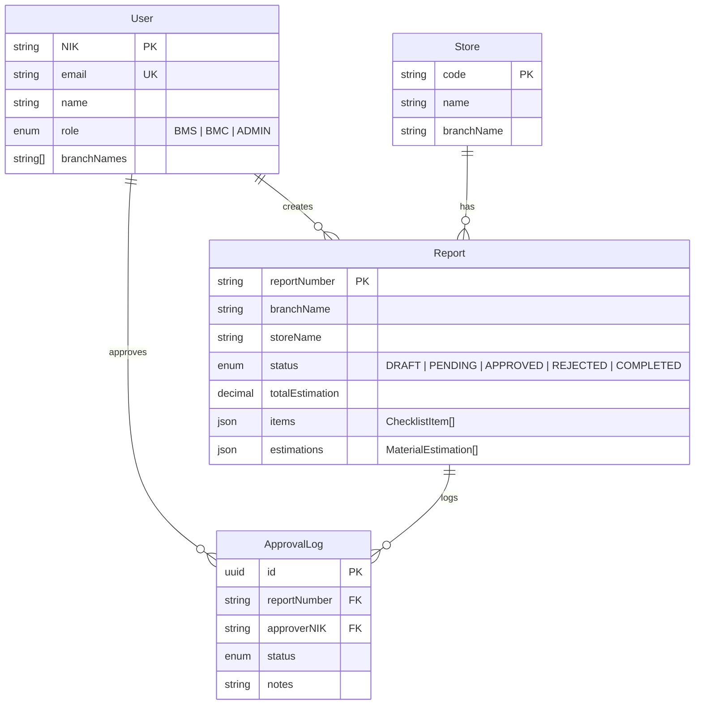

# SPARTA Maintenance


**Sistem Pelaporan dan Tracking Aset — Maintenance**

Platform terpusat untuk pelaporan kerusakan, monitoring perbaikan, dan pengelolaan estimasi biaya maintenance di seluruh store.

---

## Tech Stack

| Layer     | Technology                                                |
| --------- | --------------------------------------------------------- |
| Framework | [Next.js 16](https://nextjs.org/) (App Router)            |
| Language  | TypeScript 5                                              |
| UI        | React 19 · shadcn/ui · Tailwind CSS 4                     |
| Database  | PostgreSQL via [Neon](https://neon.tech/)                 |
| ORM       | [Prisma 7](https://www.prisma.io/) (Neon adapter)         |
| Storage   | [Supabase](https://supabase.com/) (photo uploads)         |
| Auth      | Session-based JWT ([jose](https://github.com/panva/jose)) |
| PDF       | [@react-pdf/renderer](https://react-pdf.org/)             |
| Email     | Nodemailer + Gmail OAuth2                                 |
| Font      | Outfit · Geist Sans · Geist Mono                          |

---

## Features

### Role-Based Access

| Role      | Full Name                      | Capabilities                             |
| --------- | ------------------------------ | ---------------------------------------- |
| **BMS**   | Branch Maintenance Support     | Buat laporan, estimasi BMS, lihat status |
| **BMC**   | Branch Maintenance Coordinator | Approve/reject laporan, riwayat approval |
| **ADMIN** | Administrator                  | Verifikasi dokumen, arsip, pengaturan    |

### Core Flow

```
BMS membuat laporan → Isi checklist kondisi toko → Estimasi biaya BMS
    → Submit → BMC review & approve/reject → PDF report generated
```

- **Checklist Kondisi** — Inspeksi item store dengan kondisi (Baik/Rusak/Tidak Ada), foto, dan catatan
- **Estimasi BMS** — Input material, jumlah, satuan, dan harga per item rusak
- **Draft Auto-Save** — Debounce 2 detik, termasuk checklist & estimasi BMS
- **Approval Workflow** — BMC approve/reject dengan catatan; laporan rejected bisa diedit ulang
- **PDF Generation** — Generate laporan lengkap dengan React-PDF
- **Email Notification** — Notifikasi otomatis saat laporan di-submit via Gmail OAuth2

---

## Getting Started

### Prerequisites

- **Node.js** ≥ 18
- **npm** (included with Node.js)
- **PostgreSQL** database (recommended: [Neon](https://neon.tech/))
- **Supabase** project (for photo storage)

### 1. Clone & Install

```bash
git clone <repository-url>
cd sparta-maintenance
npm install
```

### 2. Environment Variables

Buat file `.env` di root project:

```env
# Database
DATABASE_URL="postgresql://..."
DIRECT_URL="postgresql://..."    # Direct connection (non-pooled)

# Session
SESSION_SECRET="your-secret-key-min-32-chars"

# Supabase (Photo Storage)
NEXT_PUBLIC_SUPABASE_URL="https://xxx.supabase.co"
NEXT_PUBLIC_SUPABASE_ANON_KEY="eyJhbGci..."

# Gmail + Google Drive OAuth2
GMAIL_USER="your-email@gmail.com"
GOOGLE_CLIENT_ID="xxx.apps.googleusercontent.com"
GOOGLE_CLIENT_SECRET="xxx"
GOOGLE_REFRESH_TOKEN="xxx"

# App URL
NEXT_PUBLIC_APP_URL="http://localhost:3000"

# Google Drive (PDF Archive)
GOOGLE_DRIVE_ROOT_FOLDER_ID="your-google-drive-folder-id"

# Maintenance Mode (optional, requires redeploy)
MAINTENANCE_MODE="false"
MAINTENANCE_MESSAGE="Sistem sedang maintenance. Silakan coba lagi beberapa saat."

# Dev only (optional)
DEV_EMAIL_RECIPIENT="dev@example.com"
```

### 2.2 Maintenance Mode (Optional)

Saat `MAINTENANCE_MODE=true`, sistem masuk mode maintenance:

1. Semua halaman aplikasi diarahkan ke `/maintenance`.
2. Semua endpoint `/api/*` mengembalikan HTTP `503` dengan JSON maintenance.
3. Mode ini berlaku untuk semua role (termasuk ADMIN).

Perubahan nilai maintenance menggunakan environment variable dan membutuhkan redeploy.

### 2.1 Google Drive Preparation

Panduan ini memakai satu OAuth client untuk Gmail dan Google Drive sekaligus.

1. Buka Google Cloud Console di `https://console.cloud.google.com/` lalu pilih project yang akan dipakai.
2. Masuk ke `APIs & Services` → `Library`, lalu aktifkan dua API berikut:
    - `Google Drive API`
    - `Gmail API`
3. Masuk ke `APIs & Services` → `OAuth consent screen`.
4. Pilih tipe user:
    - `Internal` jika memakai Google Workspace organisasi dan semua akun ada di domain yang sama.
    - `External` jika memakai akun Gmail biasa atau akun di luar domain Workspace.
5. Isi data dasar aplikasi:
    - `App name`: bebas, misalnya `SPARTA Maintenance`
    - `User support email`: email kamu
    - `Developer contact information`: email kamu
6. Jika status app masih `Testing`, tambahkan email yang akan dipakai login ke bagian `Test users`.
7. Masuk ke `APIs & Services` → `Credentials` → `Create Credentials` → `OAuth client ID`.
8. Pilih `Application type: Web application`.
9. Isi nama client, misalnya `SPARTA Local OAuth`.
10. Tambahkan `Authorized redirect URI` berikut:

```text
http://127.0.0.1:3005/oauth2/callback
```

1. Setelah client dibuat, salin `Client ID` dan `Client Secret`.
2. Isi `.env` dengan nilai berikut:

```env
GOOGLE_CLIENT_ID="<OAuth client ID>"
GOOGLE_CLIENT_SECRET="<OAuth client secret>"
GOOGLE_REFRESH_TOKEN=""
GOOGLE_DRIVE_ROOT_FOLDER_ID="<ID folder tujuan arsip>"
```

1. Ambil `GOOGLE_DRIVE_ROOT_FOLDER_ID` dari URL folder Google Drive tujuan.
2. Contoh URL folder:

```text
https://drive.google.com/drive/folders/1AbCdEfGhIjKlMnOp
```

1. Nilai ID adalah bagian setelah `/folders/`, yaitu `1AbCdEfGhIjKlMnOp`.
2. Jalankan script generator token:

```bash
npm run auth:google
```

1. Script akan mencetak URL login Google. Buka URL itu di browser.
2. Login memakai akun Google yang memang akan dipakai untuk kirim email dan akses Drive.
3. Saat layar consent muncul, izinkan akses Gmail dan Google Drive.
4. Setelah sukses, browser akan diarahkan ke `http://127.0.0.1:3005/oauth2/callback` dan terminal akan mencetak refresh token baru.
5. Salin token tersebut ke `.env`:

```env
GOOGLE_REFRESH_TOKEN="<refresh token baru>"
```

1. Jalankan validasi koneksi Drive:

```bash
npm run test:gdrive
```

1. Jika berhasil, terminal akan menampilkan `Google Drive setup OK` dan metadata folder.

Troubleshooting cepat:

1. Error `invalid_grant`: refresh token tidak cocok dengan `GOOGLE_CLIENT_ID`/`GOOGLE_CLIENT_SECRET`, sudah direvoke, atau dibuat tanpa scope Drive. Generate ulang dengan `npm run auth:google`.
2. Error `access_denied`: akun Google yang login belum masuk daftar `Test users` jika OAuth consent screen masih mode `Testing`.
3. Error permission/404 folder: pastikan `GOOGLE_DRIVE_ROOT_FOLDER_ID` benar dan akun Google yang dipakai memang punya akses ke folder tersebut.
4. Script tidak mengembalikan refresh token: hapus grant lama untuk aplikasi tersebut di halaman Google Account Permissions, lalu jalankan lagi `npm run auth:google`.

### 3. Setup Database

```bash
# Generate Prisma Client
npm run db:generate

# Push schema ke database
npm run db:push

# (Optional) Seed data awal
npm run db:seed
```

### 4. Create Admin User

```bash
npm run create-user
```

### 5. Run Development Server

```bash
npm run dev
```

Buka [http://localhost:3000](http://localhost:3000).

---

## Project Structure

```
sparta-maintenance/
├── app/                    # Next.js App Router pages
│   ├── api/                # API routes (auth, reports)
│   ├── approval/           # BMC approval pages
│   ├── dashboard/          # Dashboard (role-based menus & stats)
│   ├── login/              # Login page
│   ├── reports/            # BMS report pages
│   │   ├── create/         # Create report form (checklist + estimasi)
│   │   │   └── components/ # Extracted UI components
│   │   ├── edit/           # Edit rejected reports
│   │   ├── finished/       # Completed reports
│   │   └── [reportNumber]/ # Report detail & PDF view
│   └── user-manual/        # User manual page
├── components/
│   ├── layout/             # Header, Footer, shared layouts
│   └── ui/                 # shadcn/ui components
├── lib/
│   ├── email/              # Email service (Gmail OAuth2)
│   ├── hooks/              # Custom React hooks
│   ├── pdf/                # PDF generation (React-PDF)
│   ├── authorization.ts    # Role-based auth guards
│   ├── checklist-data.ts   # Checklist categories & items
│   ├── prisma.ts           # Prisma client singleton
│   ├── session.ts          # JWT session management
│   └── supabase.ts         # Supabase client
├── prisma/
│   ├── schema.prisma       # Database schema
│   └── seed.ts             # Seed script
├── types/                  # Shared TypeScript types
└── scripts/                # Utility scripts (create-user)
```

---

## Database Schema



---

## Available Scripts

| Command               | Description                          |
| --------------------- | ------------------------------------ |
| `npm run dev`         | Start development server             |
| `npm run build`       | Build production bundle              |
| `npm run start`       | Start production server              |
| `npm run lint`        | Run ESLint                           |
| `npm run db:generate` | Generate Prisma Client               |
| `npm run db:push`     | Push schema to database              |
| `npm run db:studio`   | Open Prisma Studio                   |
| `npm run db:seed`     | Seed database                        |
| `npm run db:reset`    | Reset database & re-apply migrations |
| `npm run create-user` | Create a new user via CLI            |

---

## Teams

<a href="https://github.com/buildingprocess25/sparta-maintenance/graphs/contributors">
  
</a>

## License

Proprietary — Internal asset of **PT Sumber Alfaria Trijaya, Tbk**. All rights reserved. See [LICENSE](LICENSE) for details.
